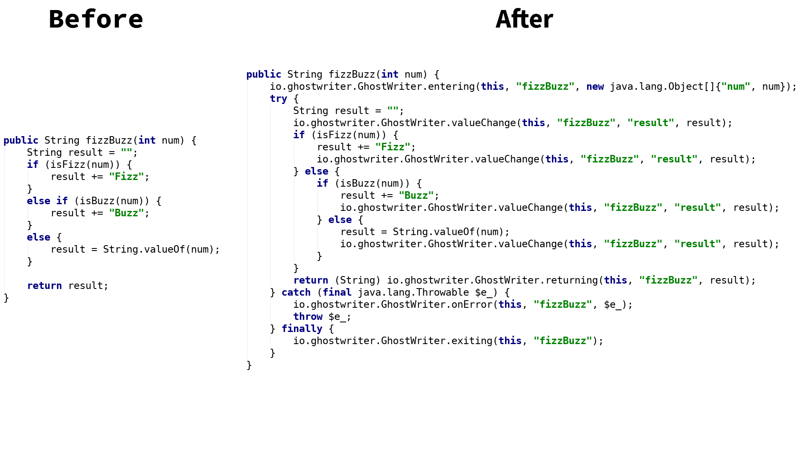
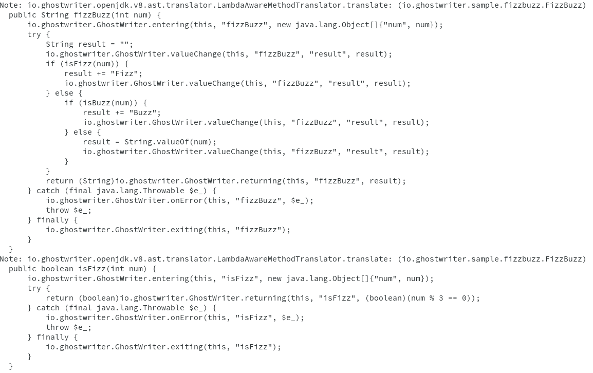

ifdef::env-github[]
:tip-caption: :bulb:
:note-caption: :information_source:
:important-caption: :heavy_exclamation_mark:
:caution-caption: :fire:
:warning-caption: :warning:
endif::[]

= GhostWriter
Norbert Sram
:toc: macro
:version: 0.3.2

image:https://travis-ci.org/GoodGrind/ghostwriter.svg?branch=master["Build Status", link="https://travis-ci.org/GoodGrind/ghostwriter"]
image:https://maven-badges.herokuapp.com/maven-central/io.ghostwriter/ghostwriter-jdk-v8/badge.svg["Maven Central", link="http://search.maven.org/#search%7Cga%7C1%7Cg%3A%22io.ghostwriter%22%20v%3A{version}"]
image:https://img.shields.io/badge/license-LGPLv2.1-blue.svg?style=flat["License", link="http://www.gnu.org/licenses/old-licenses/lgpl-2.1.html"]
image:https://api.codacy.com/project/badge/Grade/c4506e0b2280433490ec6c23cbb36c0f["Codacy code quality", link="https://www.codacy.com/app/snorbi07/ghostwriter-instrumenter?utm_source=github.com&utm_medium=referral&utm_content=GoodGrind/ghostwriter-instrumenter&utm_campaign=Badge_Grade"]
image:https://badges.gitter.im/Join%20Chat.svg["Gitter",link="https://gitter.im/snorbi07/GhostWriter?utm_source=badge&utm_medium=badge&utm_campaign=pr-badge&utm_content=badge"]

toc::[]

== About
GhostWriter is a non-invasive solution for adding common application event handler stubs to your Java code.
Essentially what you would end up writing by hand if you would like to have proper tracking of your application workflow.
After the instrumentation you will have the chance to provide custom handlers for all:

* method calls, including entering, return and exiting events
* state changes of your application, such as value assignment and other side-effectful operations
* unexpected errors

A "pseudo" before-after setup with GhostWriter (more or less readable decompiled code):

NOTE: You always see and work with your original source. The above picture is just an illustration.

== Getting started

Just add the necessary dependencies to your application and GhostWriter will take care of instrumenting the API (ghostwriter-api) calls.

IMPORTANT: You have to choose the dependency that is inline with your Java complier (JDK) version.

For Java 7 this means `ghostwriter-jdk-v7`, for Java 8 it is `ghostwriter-jdk-v8`.

GhostWriter is tested and verified with both Oracle JDK and Open JDK versions.

=== Maven

Add another `dependency` entry to the `dependencies` section.
This means that for JDK8, you will have the following entry in you `pom.xml` file.

[source, subs="verbatim,attributes"]
----
<dependency>
    <groupId>io.ghostwriter</groupId>
    <artifactId>ghostwriter-jdk-v8</artifactId>
    <version>{version}</version>
    <scope>compile</scope>
</dependency>
----

Your are done! Time to recompile your application!

=== Gradle ===

The provided snippets work with Gradle 3+.
The dependencies of GhostWriter are fetched from Maven Central. So you have to add it to your list of repositories if its not there yet.
For a project that uses JDK8, you'll will have to add the following lines to your `build.gradle` file.

[source, subs="verbatim,attributes"]
----
repositories {
    mavenCentral()
}

dependencies {
    compileOnly "io.ghostwriter:ghostwriter-jdk-v8:{version}"
}
----

Your are done! Time to recompile your application!

==== For older Java versions (Java 7)

If you are still using an older Java/JDK version such as Java 7, you'll need a different set of dependencies.

===== Maven

[source, subs="verbatim,attributes"]
----
<dependency>
    <groupId>io.ghostwriter</groupId>
    <artifactId>ghostwriter-jdk-v7</artifactId> // <1>
    <version>{version}</version>
    <scope>compile</scope>
</dependency>
----
<1> Note the use of `ghostwriter-jdk-v7`.

===== Gradle

[source, subs="verbatim,attributes"]
----
repositories {
    mavenCentral()
}

dependencies {
    compileOnly "io.ghostwriter:ghostwriter-jdk-v7:{version}" // <1>
}
----
<1> Note the use of `ghostwriter-jdk-v7`

Now recompile your application and if all goes well, you should now have support for plugging in runtime implementations.

==== Explicitly specifying the compile time annotation
This steps should only be done in case you manually set annotation processors (for whatever reason).
By default the compiler should pick up the GhostWriter annotation processor based on the service loader contract.

===== Maven
To have it explicitly set, you'll need to add the following lines to your `pom.xml`.

----
<build>
     <plugins>
         <plugin>
             <groupId>org.apache.maven.plugins</groupId>
             <artifactId>maven-compiler-plugin</artifactId>
             <version>3.6.0</version>
             <executions>
                 <execution>
                     <id>default-compile</id>
                     <phase>compile</phase>
                     <goals>
                         <goal>compile</goal>
                     </goals>
                     <configuration>
                         <!-- This is how we enable GhostWriter, the rest is more or less boilerplate of Maven -->
                         <annotationProcessors>
                             <annotationProcessor>io.ghostwriter.openjdk.v8.GhostWriterAnnotationProcessor</annotationProcessor> // <1>
                         </annotationProcessors>
                         <source>1.8</source>
                         <target>1.8</target>
                     </configuration>
                 </execution>
             </executions>
        </plugin>
     </plugins>
 </build>
----
<1> Make sure to use the correct annotation processor, for Java 7 this would be `io.ghostwriter.openjdk.v7.GhostWriterAnnotationProcessor`

The important part is the specification of the annotation processor using the `annotationProcessor` tag.
The rest is more or less Maven foreplay.

===== Gradle
In Gradle, that is done by adding the following snippet to your `build.gradle` file.

----
compileJava {
    options.compilerArgs = [
            // use the GhostWriter preprocessor to compile Java classes
            "-processor", "io.ghostwriter.openjdk.v8.GhostWriterAnnotationProcessor" // <1>
    ]
}
----
<1> Make sure to use the correct version, for Java 7 this would be `io.ghostwriter.openjdk.v7.GhostWriterAnnotationProcessor`

=== Is it working?

Set the following environmental variable to track what kind of code GhostWriter writes instead of you.

----
GHOSTWRITER_VERBOSE=true
----

You should see something like this:

As you can see there are a lot of `Note:` outputs that dump the instrumented code.

=== Runtime modules ===

With the no-operations stubs you won't get much benefit from GhostWriter, however this is where GhostWriter shines!
You can leverage one of the multiple runtime implementations available or roll your own!

==== Tracing your application

Check: https://github.com/GoodGrind/ghostwriter-tracer

==== Capturing error snapshots

TODO

=== FAQ

==== What about the performance impact?
By default GhostWriter uses no-op stubs, so the performance heavily depends on the runtime implementation you use.
The JVM does an awesome job of optimizing the generated code and the end performance depends on your application behaviour as well.
In case of performance critical section the instrumentation can be skipped by applying the correct annotation in order to minimize the performance overhead.

==== What about 3rd party code? Will that have the same stubs instrumented?
Only if you compile that yourself. Potentially you can compile your own rt.jar with GhostWriter and have full blown coverage!
The general consideration with the compile-time instrumenter implementation is that you should focus on the code that is in your control.

==== Will it mess with my stack traces? Like referring to line numbers that do not exist in my original source code?
No. The code instrumenter implementation makes sure that it is non-invasive and your stack traces refer to the correct source lines.

==== Why not a Java agent based solution?
Implementation details. In the long run both compile-time and run-time implementation will be supported.
Depending on your use case (library vs. application), you can pick the one that fits your needs.
The acceptance testing infrastructure is in place for verifying the instrumentation steps, so feel free to contribute a solution ;)

==== Is there a way to dump the instrumented code?
Yes there is.
TODO: add instructions...
